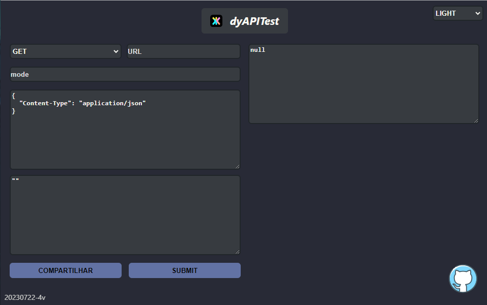

# dyApiTest: Sistema de teste de APIs

### Um modelo de site feito em React Unpkg.

### Ajude-nos, a melhorar o site 🤩❤️

    FEITO POR https://github.com/LucasATS

[🔗 ACESSE O PROJETO ](https://dyapitest.vercel.app/)

## __📂 PLAY__
> Apenas edite o index.html

> Se você tiver python, use python.exe -m http.server 3002

## __🎯 METAS__
- [X] Ser simples
- [X] Sistema de API
- [X] Sistema para ler link, salvar link
- [X] Formatador de texto para json
- [X] Alertas mais elegantes
- [X] Melhorar arquitetura para ficar mais legivel
- [ ] Melhorar sistema de link, otimizar os links para poderem ter mais informações
- [ ] Adicionar CEO
- [ ] Thema dracula - dark, salvar preferencia do thema nos cookies
- [ ] Reconstruir lógica para o header
- [ ] Permitir enviar arquivos
- [ ] Construir exemplo de código (javascript(fetch), javascript(axios), python...)
- [ ] Titulo da API (ex: API para login)
- [ ] Menu lateral para selecionar APIs
- [ ] Adicionar multiplos APIs para uso (arrey no link)
- [ ] Adicionar "Loading..." ao abrir o site

<!--
## __❤ AGRADECIMENTOS__
[@<NOME>](<LINK>) "<MENSAGEM>"
-->

## __🛠 TECNOLOGIAS__ 

## __😘 CONTATO__ <ALTERE APENAS OS LINKS DOS HREF>

  
  
  
   
    

